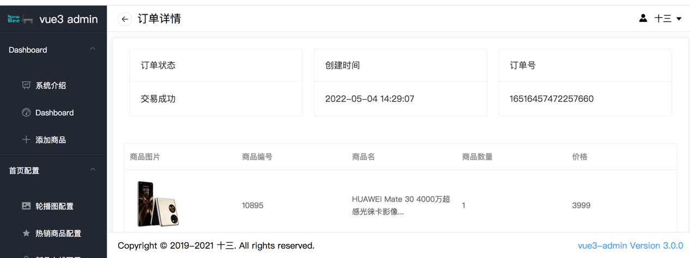

## 项目介绍
### newbee-mall商城go版本
本项目为[newbee-mall-api](https://github.com/newbee-ltd/newbee-mall-api) 的go版本,使用原版本的所有数据结构，适配原商城的前端项目

项目框架参考链接: [gin-vue-admin](https://github.com/flipped-aurora/gin-vue-admin)

### 技术栈
> 1、Mysql 5.6
> 
> 2、Go 1.17.3
> 
> 3、gin(web框架)+grom(ORM)+zap(日志)+Viper(配置)

项目逻辑比较简单也比较清晰，所有的数据都是走的mysql，没有其他的中间件，非常适合练手。
因为要适配前端的项目，所以有的地方做了一些 "特殊处理"，代码中有注释。

有的地方实现方式不够优雅，如果您有更合适的方式来实现，或者发现有BUG，欢迎提交PR。

### 本地启动
-- --
#### 后端项目启动
使用 `Goland` 等编辑工具，打开server目录，不可以打开 gin-vue-admin 根目录

```bash
# 克隆项目
git clone https://github.com/627886474/newbee-mall-api-go

# 使用 go mod 并安装go依赖包
go generate
# 编译 
go build -o server main.go (windows编译命令为go build -o server.exe main.go )
# 运行二进制
./server (windows运行命令为 server.exe)
```
#### 前端项目启动
在vite.config.js中将前台项目中的请求地址替换为本后端的地址,如本地启动将原
>http://backend-api-02.newbee.ltd/manage-api/v1

替换为
> http://localhost:8888/manage-api/v1

然后按照原项目的部署说明部署即可 （将数据库中商品的图片字段替换为可以通过网络显示的图片，本地项目没有对应的图片)

[后台管理项目](https://github.com/newbee-ltd/vue3-admin)

测试用户名：admin  测试密码：123456


[前台商城](https://github.com/newbee-ltd/newbee-mall-vue3-app)
直接注册账号就可以了
-- --

### 目录说明
| 文件夹       | 说明                    | 描述                        |
| ------------ | ----------------------- | --------------------------- |
| `api`        | api层                   | api层 |
| `--v1`       | v1版本接口              | v1版本接口                  |
| `config`     | 配置包                  | config.yaml对应的配置结构体 |
| `core`       | 核心文件                | 核心组件(zap, viper, server)的初始化 |
| `global`     | 全局对象                | 全局对象 |
| `initialize` | 初始化 | router,redis,gorm,validator, timer的初始化 |
| `--internal` | 初始化内部函数 | gorm 的 longger 自定义,在此文件夹的函数只能由 `initialize` 层进行调用 |
| `middleware` | 中间件层 | 用于存放 `gin` 中间件代码 |
| `model`      | 模型层                  | 模型对应数据表              |
| `router`     | 路由层                  | 路由层 |
| `service`    | service层               | 存放业务逻辑问题 |
| `utils`      | 工具包                  | 工具函数封装            |

### 项目展示


